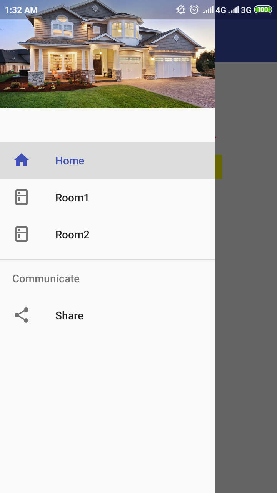
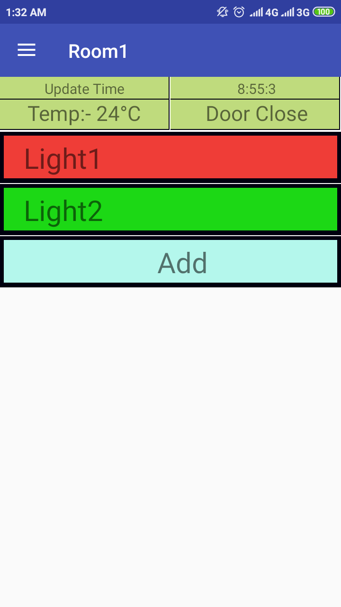

# Home-Automation

In this app you can see your home status like room temperature, door is open/close,which light is on /off.
You can control your home equipments from anywhere in the world.

I used three setup for this home automation.

# First at home :-

   In this I use NodeMCU 1.0, Temperature sensor,ultrasonic sensor, a 16*2 LCD display.
   Temperature data, ultrasonic data and light condition are sent to firebase database using NodeMCU.
   It also receive data from database  to update the change from app.
   
   And the LCD display shows you the last action taken by the user and  time using NTP, and wifi status.
   
   # Second at firebase :-
  You have to make a account on firebase. Then start a project on that. Then get AUTH and SECURITY KEY  of that project 
  and change  them in firebase_connection.ino file.

   # Another in mobile :-
   In the app there are room1 and room2(you can add another room also only adding new fragment in main activity).
   

   In the room there will be temperature, last update time of database, door is open or close and lights.
    You can add lights accotding yo your requirement dynamically.  
    

   
   And you can also delete the any light by long pressing the light.
   It has a fire alert alarm also.
   It will start siren if temperature  reach more than  100°C.
